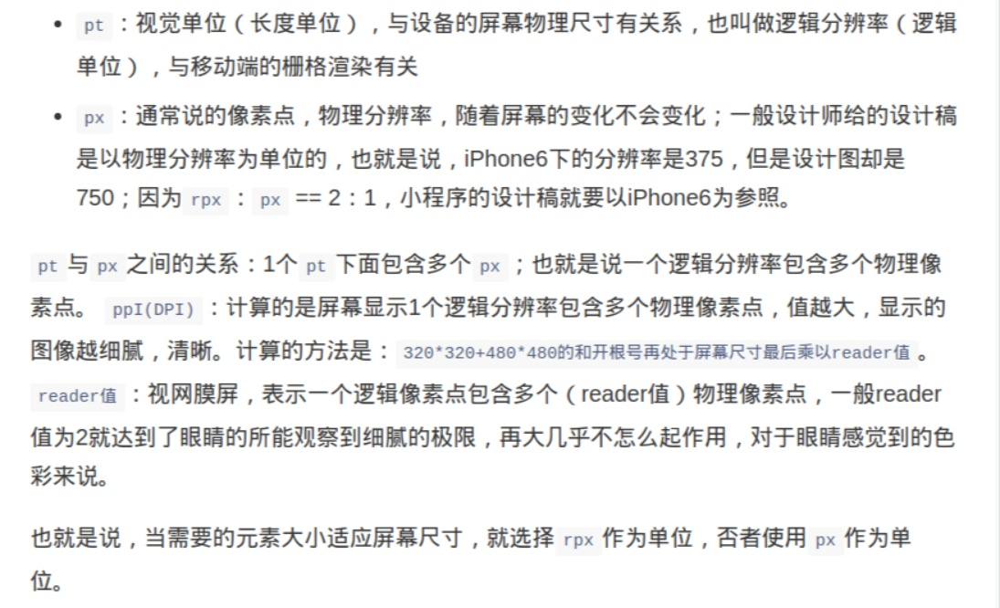
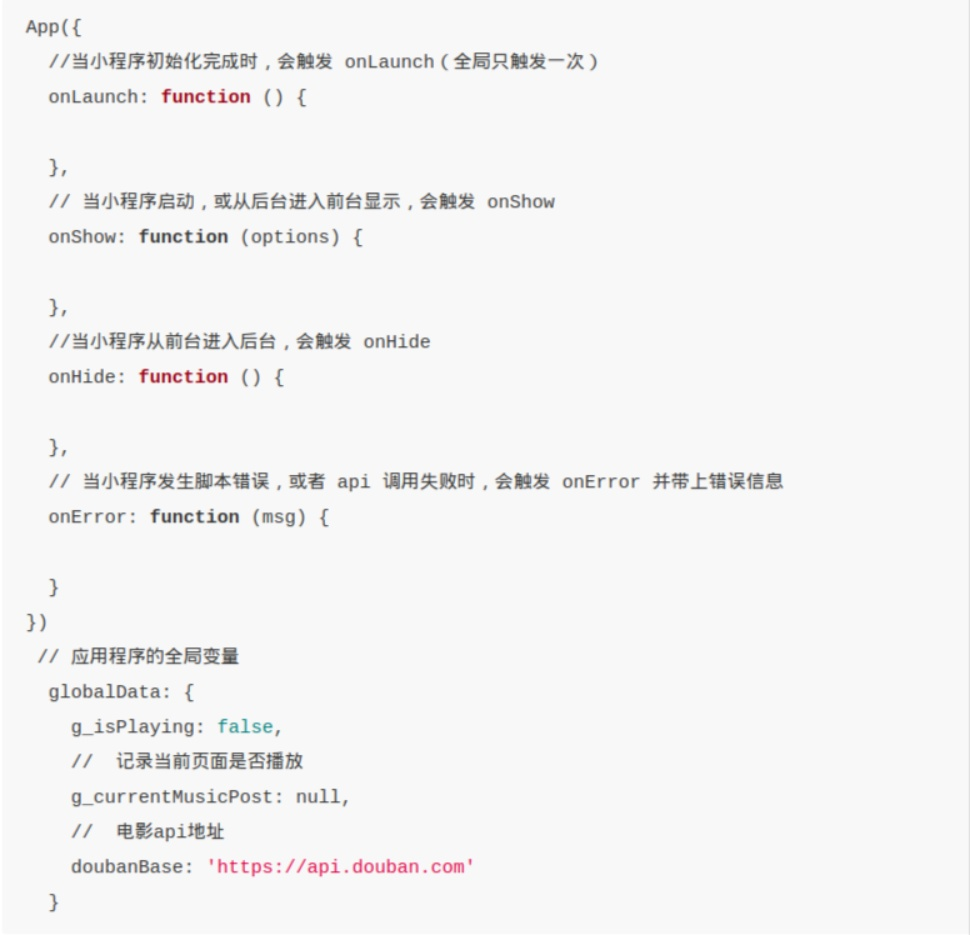
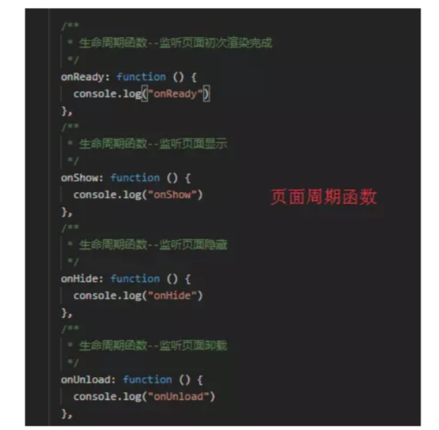
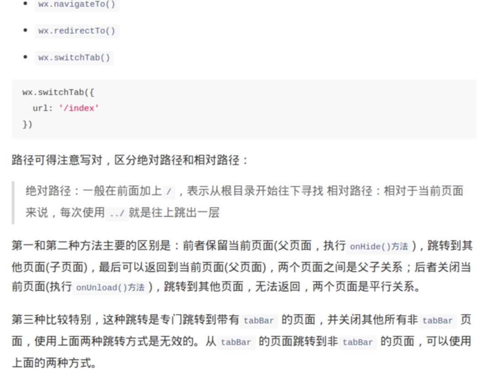

# 微信小程序
## 微信小程序相较于H5开发
1. 运行环境不同，虽然小程序开发使用了h5相关的技术，但他并不是运行在完整意义上的浏览器上，正如文档着重强调不能在小程序是运行在jsCore，在脚本中无法使用window，也无法操作组件，使用jquery这类框架
2. 开发成本不同。对于传统H5开发来讲，我们应该考虑一些什么问题，抛开开发工具不谈，大到选择技术框架（angular，react，vue）,打包管理工具（webpack,gulp,grunt,parcel，rollup）,小到UI库选择，浏览器兼容性都需要我们一一考虑，虽然一办团队来讲，会形成自己的一套体系，会节省一部分时间，但随着技术的更新，版本迭代这些成本也不会很低

  但对于小程序来讲，微信提供统一的开发工具（目前是没有linux版本），统一规范的开发标准结构，虽然VXML使用的是自定义组件，但结合文档来讲，也是比较容易的。当你需要一些功能时，都会有相对应的api解决你的问题，ui框架是与微信风格十分相近的weui库，开发中也不再需要考虑浏览器兼容问题专注实现程序本身就好。
3. 系统权限的不同 对于web开发来讲，始终建立在浏览器层面进行开发，对于权限的获取是十分稀少，再结合浏览器的兼容考虑，这点可以说是十分大的问题。而小程序的则不一样，无论是网络状态，修改授权，本机信息，亮度，振动等权限，都可以无缝衔接，官方宣称的小程序是可以做到与native app一样的流畅体验。这一点我觉得也是h5应用始终被人吐槽说的逻辑简单，功能单一的原因
4. 应用流畅度，
5. 依托微信庞大用户圈，在微信中，小程序解决了一个问题，那就是使用服务，不需要下载安装app，不需要关注微信公众号，就可以有几乎与原生app等同的体验效果。
6. 发布流程，相对于传统h5开发来讲，发布过程则略显复杂，需要通过自带开发工具绑定appid之后，push代码到微信平台，通过选择固定版本进行审批，审批通过后即可发布，顺利的话，3-5天的时间是可以知晓结果。

## 1 项目结构
### 1.1 app.json
 app.json是小程序的全局配置，包括了小程序的所有页面路径、界面表现（设置页面背景，文字颜色）、网络超时时间、底部 tab（tabBar为对象，其中list表示展示的导航栏） 等。
#### 1.1.1 pages
  接受一个数组，每一项都是字符串，来指定小程序由哪些页面组成，数组的第一项代表小程序的初始页面。小程序中新增/减少页面，都需要对 pages 数组进行修改（不需要添加文件后缀）。
#### 1.1.2 window
 用于设置小程序的状态栏、导航条、标题、窗口背景色(具体属性参考[开发文档](https://mp.weixin.qq.com/debug/wxadoc/dev/framework/config.html))
#### 1.1.3 networkTimeout
可以设置各种网络请求的超时时间,包括（request，connectSocket，uploadFile，downloadFile）。
#### 1.1.4 tabBar
配置导航栏，tabBar为对象，list为具体展示导航配置，数据类型为数组，个数最少为2个，最多为5个。定位只能选择top和bottom。当导航定位为底部时，设置的图片文件路径有效果，对于选中与未选中图片展示，只能分别设定不同的图片路径实现。
### 1.2 VXML模板文件
与html文件相似，为描述当前这个页面的结构。小程序封装了一些常用的组件，可以直接使用，常用组件包括文本，按钮，单选框和地图等[点我跳转](https://mp.weixin.qq.com/debug/wxadoc/dev/component/)
VXML中不支持html中的获取节点方法，使用小程序封装的方法 进行获取[点我跳转](https://mp.weixin.qq.com/debug/wxadoc/dev/api/wxml-nodes-info.html#wxcreateselectorquery)
支持的富文本标签,通过使用<rich-text>[标签列表](https://mp.weixin.qq.com/debug/wxadoc/dev/component/rich-text.html)
#### 1.2.1 需要注意的组件
1. image组件，图片组件模式有13种，4种缩放，9种裁剪方式，支持图片懒加载。
2. camera相机组件，需要用户授权的组件.

### 1.3 WXSS 样式
样式文件，语法与常用css基本一致，但其中还是有几点不同:
1. 新增尺寸单位rpx


2. 小程序支持页面中的样式和全局样式，页面配置的样式优先级更高，而全局中的app.wxss适用于所有符合组件。

3. 此外 WXSS 仅支持部分 CSS 选择器（这点还不是很清楚，id和class支持，可能为高级的nth之类的吧！）

### 1.2 pages
该目录下存放各个页面，每个目录对应一个页面，都有一套自己的配置json，模板VXML，样式WXSS以及逻辑交互JS。其中的page.json只对当前页面有作用。

## 2 生命周期
### 2.1 小程序生命周期函数

用户点击左上角关闭或者点击home键离开微信，小程序并没有直接销毁。只有小程序进入后台一段时间或者系统资源占用过高才会被正在销毁

*顺便说一下全局变量的使用方式，页面中调用getApp()，获取全局对象，所有的数据都为对象属性*

### 2.2 页面生命周期函数


## 3 页面跳转记录
页面跳转方法有 navigateTo，redirectTo和switchTab。


## 4 小程序能力
这个版本的小程序，已经进行了超级进化，不仅对应用开放了更多的权限，而且对于开发者来言变得更加友好。同时还有一个好消息就是，书写时支持es6语法。
### 4.1 支持能力
1. 上传与下载文件可以直接传到开发者服务器，而不像公众号web开发中需要经过微信服务器进行转发处理.[详情点我](https://mp.weixin.qq.com/debug/wxadoc/dev/api/network-file.html#wxuploadfileobject)
2. 支持常规request请求和websocket，但需要注意的时request请求的接口地址必须是支持https证书认证同时需要在小程序后台进行请求安全域名配置，websocket同样需要进行相同的配置，只是接口必须为wxs协议[详情点我](https://mp.weixin.qq.com/debug/wxadoc/dev/api/network-socket.html#wxconnectsocketobject)
3. 多媒体控制，包括语音，视频，录音以及相机，常用的sdk都具备。
4. 支持获取地理位置。
5. 系统信息。包括品牌，型号，像素比，微信版本号，操作系统和基础库版本等。
6. 网络状态，可以识别 wifi/2g/3g/4g/unknown(Android下不常见的网络类型)/none(无网络)
7. 加速度计以及罗盘，加速度为三维运动，比如晃动旋转（此处似乎知道手机小黄人晃动，眼睛跟着转动是可以根据这个实现）
8. 拨打电话，传递一个字符串，调用手机拨打电话 *获取用户微信号绑定手机号需要认证小程序*
9. 控制剪贴板 实现点击复制和获取剪贴板内容。
10. 蓝牙控制，iBeacon控制（这个不知道是什么）和屏幕亮度控制。
11. 用户截屏事件监听
12. 控制手机振动，nfc和wifi。
13. 小程序页面控制转发，提供onShareAppMessage方法，当定义该方法后，右上角才会显示转发按钮，该方法返回两个参数，一个为标题，一个为页面路路由
14. 小程序授权说明
    1. 用户未接受或拒绝过权限，会弹窗询问用户，用户点击同意后调用
    2. 已授权，可直接调用
    3. 拒绝授权后，直接进入fail

### 4.2 自定义组件
从小程序基础库版本 1.6.3 开始，小程序支持组件化编程。

#### 4.2.1 自定义组件的结构与页面一致，同时具备json wxml wxss js 4个文件，需要注意以下几点：
1. 编写组件，需要在组件json文件中进行组件声明，
```
{
  "component": true
}
```
2. 编写模板，样式以及逻辑处理文件，声明组件时，使用Component()注册组件，而不是页面中的Page。
```
Component({
  properties: {
    // 这里定义了innerText属性，属性值可以在组件使用时指定
    innerText: {
      type: String,
      value: 'default value',
    }
  },
  data: {
    // 这里是一些组件内部数据
    someData: {}
  },
  methods: {
    // 这里是一个自定义方法
    customMethod: function(){}
  }
})
```
3. 使用组件的时候，需要在页面的配置json中进行引用声明，需要提供标签名和对应的文件路径(所有的路径都为相对路径)
```
{
  "usingComponents": {
    "component-tag-name": "path/to/the/custom/component"
  }
}
```
页面中使用组件样例(属性在标签中为短横线连接，js中为小驼峰)
```
<view>
  <!-- 以下是对一个自定义组件的引用 -->
  <component-tag-name inner-text="Some text"></component-tag-name>
</view>
```

### 4.2.2 组件中的slot子节点
1. 组件模板中可以提供一个 <slot> 节点，用于承载组件引用时提供的子节点
代码样例
```
<!-- 组件模板 -->
<view class="wrapper">
  <view>这里是组件的内部节点</view>
  <slot></slot>
</view>
```
```
<!-- 引用组件的页面模版 -->
<view>
  <component-tag-name>
    <!-- 这部分内容将被放置在组件 <slot> 的位置上 -->
    <view>这里是插入到组件slot中的内容</view>
  </component-tag-name>
</view>
```
2. 默认情况下，一个组件的wxml中只能有一个slot。需要使用多slot时，可以在组件js中声明启用，在这个组件的wxml中使用多个slot，以不同的 name 来区分
```
Component({
  options: {
    multipleSlots: true // 在组件定义时的选项中启用多slot支持
  },
})
```
```
<!-- 组件模板 -->
<view class="wrapper">
  <slot name="before"></slot>
  <view>这里是组件的内部细节</view>
  <slot name="after"></slot>
</view>
```
```
<view>
  <component-tag-name>
    <!-- 这部分内容将被放置在组件 <slot name="before"> 的位置上 -->
    <view slot="before">这里是插入到组件slot name="before"中的内容</view>
    <!-- 这部分内容将被放置在组件 <slot name="after"> 的位置上 -->
    <view slot="after">这里是插入到组件slot name="after"中的内容</view>
  </component-tag-name>
</view>
```
3. 组件生命周期函数
  * created,在组件实例进入页面节点树时执行,不能调用 setData
  * attached 在组件实例进入页面节点树时执行
  * ready 在组件布局完成后执行
  * moved 在组件实例被移动到节点树另一个位置时执行
  * detached 在组件实例被从页面节点树移除时执行
4. behaviors-用于组件间代码共享的特性
  * 每个 behavior 可以包含一组属性、数据、生命周期函数和方法，组件引用它时，它的属性、数据和方法会被合并到组件中，生命周期函数也会在对应时机被调用。每个组件可以引用多个 behavior 。 behavior 也可以引用其他 behavior。
  * behavior 需要使用 Behavior() 构造器定义(结构与一般组件相同，只是构造器不同)。
  ```
  module.exports = Behavior({
  behaviors: [],
  properties: {
    myBehaviorProperty: {
      type: String
    }
  },
  data: {
    myBehaviorData: {}
  },
  attached: function(){},
  methods: {
    myBehaviorMethod: function(){}
  }
})
  ```
  在behaviors数组中列出需要的behavior就行。
  * 如果有同名的属性或方法，组件本身的属性或方法会覆盖 behavior 中的属性或方法，如果引用了多个 behavior ，在定义段中靠后 behavior 中的属性或方法会覆盖靠前的属性或方法
  * 如果有同名的数据字段，如果数据是对象类型，会进行对象合并，如果是非对象类型则会进行相互覆盖
  * 生命周期函数不会相互覆盖，而是在对应触发时机被逐个调用。如果同一个 behavior 被一个组件多次引用，它定义的生命周期函数只会被执行一次。
5. 组件间通信-relations
  * 通过在组件中定义关系，相互影响，关系类别为parent，child，ancestor，descendant。
  ```
  Component({
  relations: {
    './custom-li': {
      type: 'child', // 关联的目标节点应为子节点
      linked: function(target) {
        // 每次有custom-li被插入时执行，target是该节点实例对象，触发在该节点attached生命周期之后
      },
      linkChanged: function(target) {
        // 每次有custom-li被移动后执行，target是该节点实例对象，触发在该节点moved生命周期之后
      },
      unlinked: function(target) {
        // 每次有custom-li被移除时执行，target是该节点实例对象，触发在该节点detached生命周期之后
      }
    }
  },
})
  ```
  在组件中也需要告知父级组件关系
  ```
  Component({
  relations: {
    './custom-ul': {
      type: 'parent', // 关联的目标节点应为父节点
      linked: function(target) {
        // 每次被插入到custom-ul时执行，target是custom-ul节点实例对象，触发在attached生命周期之后
      },
      linkChanged: function(target) {
        // 每次被移动后执行，target是custom-ul节点实例对象，触发在moved生命周期之后
      },
      unlinked: function(target) {
        // 每次被移除时执行，target是custom-ul节点实例对象，触发在detached生命周期之后
      }
    }
  }
})
  ```


#### Tips
1. WXML节点标签名只能是小写字母、中划线和下划线的组合，所以自定义组件的标签名也只能包含这些字符
2. 自定义组件也是可以引用自定义组件的，引用方法类似于页面引用自定义组件的方式
3. 自定义组件和使用自定义组件的页面所在项目根目录名不能以“wx-”为前缀，否则会报错
4. 旧版本的基础库不支持自定义组件，此时，引用自定义组件的节点会变为默认的空节点
5. 属性获取可通过data进行获取，所有属性名与data字段都不能冲突

### 4.3 工具
小程序上传代码后支持预览和体验功能，有两种方式，一种是后台扫描二维码，而另一种则为使用小程序开发助手。当然所有的前提则为你个人微信号对于这个小程序是有权限的。

##框架
1. wepy腾讯开源小程序框架，vue风格，支持引入npm包，支持Promise，支持Less/Sass/Stylus、Babel/Typescript，支持Sourcemap，ESLint[点我跳转](https://github.com/Tencent/wepy)
2. mpvue（美团开源小程序框架）框架基于 Vue.js 核心，mpvue 修改了 Vue.js 的 runtime 和 compiler 实现，使其可以运行在小程序环境中[点我跳转](https://github.com/Meituan-Dianping/mpvue)
3. grace

## 小知识点
1. 地图组件为原生组件，层级为最高，使用绝对定位和zindex是无法实现在地图上覆盖一层。
2. 微信时间选择中，日期与时间是分开的，如果需要同时使用，则需要通过第三方库或者自己实现。
3. 绑定事件中支持常规绑定，使用bind，也可以使用阻止事件冒泡的事件绑定，使用catch绑定。
